# Python Scraper for the CGE Website.

CGE = Consulado General de España

## Introduction

The website contains information about an incoming date for booking an appointment to initiate some paperwork.

They usually provide the date with a very short notice (or none at all) and the available slots for the appointments are
filled sooner than I have time to even realize that the slots were even available.

So, I implemented a very simple but yet effective scraper that visits the website every hour, and parses the
information. If a new date is found for the slots, it will notify me via GMail and Telegram, so I don't miss it.

NOTE: The full code can be found in this [Github repo][github-repo], so in this post I'll only share code snippets
without many very important fetures that are not essential to understand the key concept, and that can also get in the
way of it on a first read (e.g., file path resolution, error handling, logging, tests, etc).

[github-repo]: https://github.com/danielcaballero88/scrape-cgeonline

## Simple Scraping

Both the website and the objective are simple enough.

The website is just HTML with no need for rendering dynamic content or providing credentials of any kind. The objective
is to scrape a table element, looking for the information contained in a single row that we can identify for the content
of the first column.

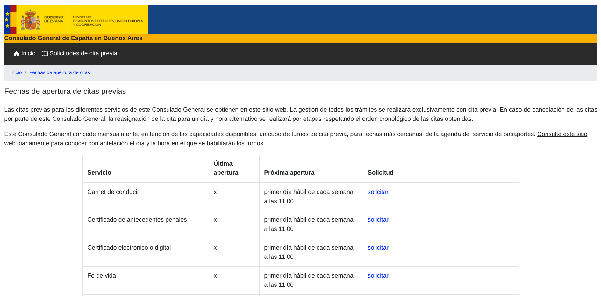

Therefore, there is no need to use scraping frameworks like Scrapy, which are awesome but, for this particular case,
also a huge overkill. Simply using the Python `requests` library to get the website response will suffice, and parsing
the information with the also amazing [Beautiful Soup][beautiful-soup] will achieve the results beautifully (pun
intended).

[beautiful-soup]:https://beautiful-soup-4.readthedocs.io/en/latest/

To get the response and, specifically, the target row, we just need to use a few lines of code:

```python
# Fetch the response.
req = requests.get(<url>, timeout=10)
soup = BeautifulSoup(req.text, features="html.parser")

# Get the target row from the table.
target_row = soup.find_all(lambda x: x.name == "tr" and "Registro Civil-Nacimientos" in x.text)
target_cells = row.find_all("td")

# Parse information into a dictionary.
result = {
    "servicio": cells[0].text,
    "ultima_apertura": cells[1].text,
    "proxima_apertura": cells[2].text,
    "solicitud": cells[3].a.get("href"),
}
```

That's it, now we have the information. Most tutorials I've found online for simple scrapers end here, but this is still
completely useless (like those tutorials) unless we actually do something with that data.

## GMail Notifications

### Set up the GMail API

**NOTE: This solution is now replaced by a better one, check the section "Use a Password App" to see the better solution. The issue with the GMail API is that it is intended for web apps where the users provide permissions to the app using OAuth2, but those permissions don't last undefinitely, and thus need to be renewed periodically. What we want is to send emails programatically, so the app needs to be able to authenticate undefinitely.**

We will implement a system of notifications using GMail (then we'll add Telegram notifications as well for redundancy).

First we need a Google account and access to a GCP Project (both the account and the GCP Project are free to create if
you don't have one). In the GCP Project you need to enable the GMail API (which is also free to a very high number of
requests, that we won't be even close to reach).
There is no need to explain how to enable this API in much detail because it's simple enough to search for it on Google
and get the few steps that need to be taken. Also, the specific steps may vary because Google keeps an active
development and is prone to change a few things here and there. Today (Dec 3 2022) the steps are these ones:

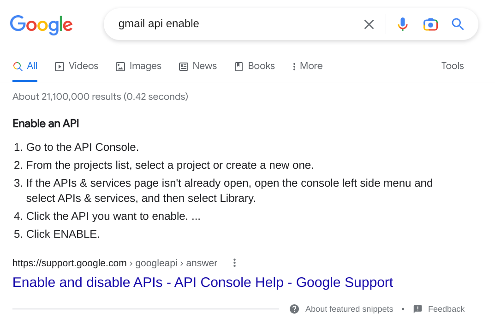

After enabling the GMail API, you can go into the your GCP Project and create credentials for your application.

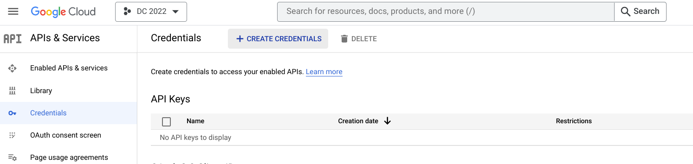

The credentials will be stored in a json file that you can download and then use in your application (in this specific
case, the application is the scraper that we are implementing). The application will use the credentials to generate
tokens for users: when a user wants to use the application, the user will be prompted to grant some permission, as in
the following example image (where the user will grant access to some fitness data by clicking in the "Allow" button):

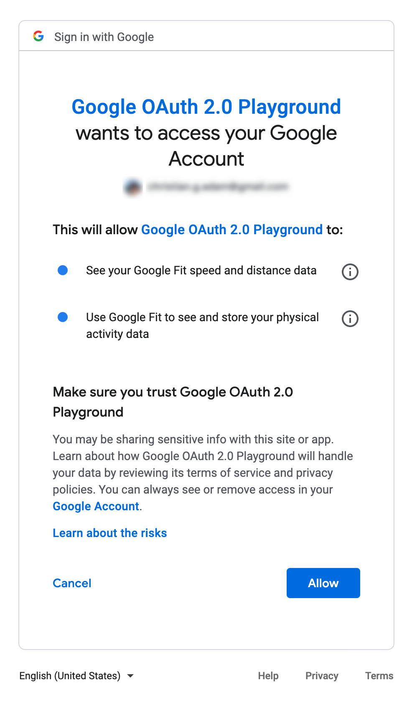

NOTE: Google won't let just anyone create an application and start asking any user for permissions.

That would be dangerous, I could implement a malicious app that asks people for permission to access their emails or
their photos, and surely before Google or someone realizes that there is some malicious app running, there will be a lot
of people that will just grant access without carefully reading the whole thing and thinking about the possible
consequences (come one I know you've done it too, or at least I have...). To avoid this potential case, Google needs to
verify the app before it goes public and anyone can use it. Before that, we need to use the app in *testing mode*, which
means only a few selected users can test it, and we need to add those test users for the app that we created the
credentials for:

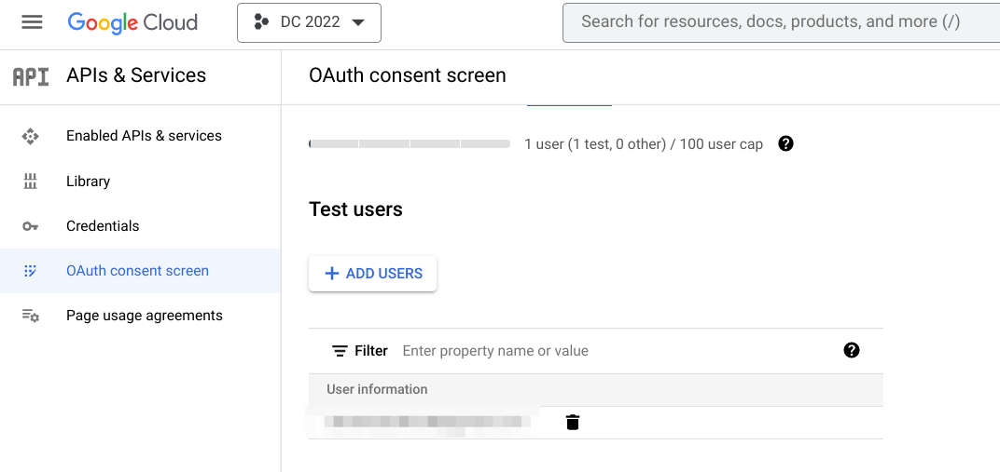

For our case scenario, however, this is perfect, because we only want to send notification emails from a single GMail
account (whatever that account is). So just add that account as a test user account, and that's it.

#### GMail API Authentication

Now that we have the credentials, which will be valid for that single test user account, we can set up the
notifications.

First we need to install some libraries:

```bash
pip install google-api-python-client google-auth-httplib2 google-auth-oauthlib
```

Now we need to authenticate the user, which we'll need to do only once:

```python
from google.auth.transport.requests import Request
from google.oauth2.credentials import Credentials
from google_auth_oauthlib.flow import InstalledAppFlow

# Authentication
SCOPES = ["https://www.googleapis.com/auth/gmail.compose"]

creds = None
if os.path.exists("token.json"):
    creds = Credentials.from_authorized_user_file("token.json", SCOPES)
# If there are no (valid) credentials available, let the user log in.
if not creds or not creds.valid:
    if creds and creds.expired and creds.refresh_token:
        creds.refresh(Request())
    else:
        flow = InstalledAppFlow.from_client_secrets_file("credentials.json", SCOPES)
        creds = flow.run_local_server(port=0)
    # Save the credentials for the next run
    with open("token.json", "w", encoding="utf-8") as token:
        token.write(creds.to_json())
```

Here we provided the credentials file downloaded (renamed as `credentials.json` and made available to the application)
and note that we mention another file `token.json`: When we run this code snippet, we will get a OAuth prompt to provide
access to whatever scopes we defined in the `SCOPES` list, which in this case will provide only access to create drafts
and send emails ([more on scopes here][gmail-api-scopes]) our application (it will warn us that the app is in testing
mode, but we know that already, so just go ahead and allow access... it's your own app after all). After doing this, the
`token.json` file will be downloaded and saved, and that is the credential that will be used from then on.

[gmail-api-scopes]:https://developers.google.com/gmail/api/auth/scopes

#### GMail API - Send an email

We'll create a draft and send it, using the `creds` obtained in the previous section:

```python
import base64
from email.message import EmailMessage
from googleapiclient.discovery import build

# Get GMail API service.
service = build("gmail", "v1", credentials=creds)

# Create empty email object.
message = EmailMessage()
# Set up
message["To"] = "...@gmail.com"
message["From"] = "...@gmail.com"
message["Subject"] = <subject>  # Replace <subject> with the intended subject for the email.
message.set_content(<content>)  # Replace <content> with the intended content for the email.

# Encode the message.
encoded_message = base64.urlsafe_b64encode(message.as_bytes()).decode()
create_message = {"message": {"raw": encoded_message}}

# Create the draft.
draft = (service.users().drafts().create(userId="me", body=create_message).execute())

# Send it.
service.users().drafts().send(userId="me", body={"id": draft["id"]}).execute()
```

When creating the draft we need to set the `From` field as the authorized user email, the `To` field can be a different
email address, or a list of addresses, that will receive the notifications.

And that's it for sending a notification via email!

#### GMail API - Set up Notifications

To set up the notifications we just need to put the previous snippets together, and in the case that there is new
data for the next opening ("proxima apertura" since the website is in spanish), then send the notification.

```python

# Code to scrape the website.
...

if result["proxima_apertura"] != "fecha por confirmar":
    # Code to send the email.
    ...
```

Note that the condition, as it is, it's a bit rigid, so it's better to replace it for a regex to match possible
variations of the same data.
To see how that is implemented simply check out the code in the [Github repo][github-repo].

### Use a Password App

To send notifications using GMail we need, naturally, a Google account.
I think that the best approach is to create a new account to send these emails, to avoid using one's personal Google account in case there is a security breach and someone gets access to the password app we'll create.
Having a new account created just for these purposes means that even if someone gets access to the password app, there's no much harm that they can do, or non at all.

So let's create a new Google account, and call it `notifier.bot@gmail.com` (this exact address is probably taken but the actual account name is not important, you can create it with whatever name you prefer).

After going over all the steps, we need to enable [2 step verification][google-2-step-verification] first, because it is a pre-requisite that Google has before we are able to create a Password App.
Simply go over the steps and use one of the methods provided for 2 step verification.

Once that is set up, we can now [create a App Password][google-app-password].
The steps are quite simple, just a few clicks and we get a new App Password (let's call it `<app-password>`) that we can use to authenticate to our account using it instead of our regular passowrd.
The obvious benefit is that we can use this App Password in our app and we don't need to include our actual account password, so if by mistake it is filtered and someone gains access to it, we can simply revoke it and we never lose the control of the account.

Now that we have a notifier Google account and we created a Password App for it, the code to create and send an email is quite simple:

```python
import json
import os
import smtplib
from email.message import EmailMessage

# Read email address and app password from secret file.
here_path = os.path.dirname(__file__)
base_dir_path = os.path.dirname(here_path)
secrets_file_path = os.path.join(base_dir_path, "secrets", "gmail.json")
with open(secrets_file_path, "r", encoding="utf-8") as gmail_secrets_file:
    gmail_secrets = json.load(gmail_secrets_file)
    gmail_account = gmail_secrets["account"]
    gmail_password = gmail_secrets["password"]

# Create message.
message = EmailMessage()
message["To"] = "danielcaballero88@gmail.com"
message["From"] = "danielcaballero88@gmail.com"
message["Subject"] = subject
message.set_content(content)

# Send email.
with smtplib.SMTP_SSL("smtp.gmail.com", 465) as smtp:
    smtp.login(gmail_account, gmail_password)
    smtp.send_message(message)
```

[google-2-step-verification]: https://support.google.com/accounts/answer/185839?hl=en&co=GENIE.Platform%3DDesktop

[google-app-password]: https://support.google.com/accounts/answer/185833?hl=en

## Telegram Notifications

Although we already have GMail notifications, and that is good enough already, it's good to have some redundancy in
notifications because one of the notifications systems might fail.
Of course that it's also possible for both notification systems to fail, but to do so simultaneosly is way less likely,
so we can feel a lot more secure on our notifications if we have more than one system implemented in parallel.

To send notifications via Telegram we'll create a new Telegram bot, add it to the Telegram chat where we want to receive
the notifications, and implement the code to send the notification message to that channel.

The best approach is to follow the [official tutorial for creating and setting up a bot][telegram-bot-guide].
Nonetheless, here I'll put a summary of the steps I followed.

[telegram-bot-guide]: https://core.telegram.org/bots/tutorial

### Create a Telegram bot

Simply look for the `@BotFather` in the Telegram messaging app, and ask to create a new bot by sending a `/newbot`
message to it.
It will prompt for the bot name, we can give something like `NotifierBot`, but this one will most likely be taken, so
use a unique one (and by all means try to use CamelCase, just for consistency sake).
The Bot Father will then provide a token for the bot (let's refer to it as `<token>`), which is meant to be kept secret,
just save it for now.

Now you can look for your bot and start interacting with it, but since there is nothing implemented for it, it will be
like talking to a wall (in the search bar look for `@NotifierBot`, you should see it there).
What we can do, however, is to get the chat id for this chat, or add the bot to another chat if we already have a chat
dedicated to notifications, or we can create a new chat for it, whatever you choose is up to you, and it won't affect
the next steps much.

We do need to get the chat id however, because we wanto the bot to send messages to that particular chat, so we need to
visit the following url:

```
https://api.telegram.org/<token>/getUpdates
```

Just replace `<token>` with your actual token and visit it in your browser.
You'll get a json and somewhere in it, something like this:

```
...
"my_chat_member":{"chat":{"id":<chat_id>,"
...
```
where `<chat_id>` is a positive or negative number.

Copy that number and save it too.

### Implement the notifications

First of all, let's create a configuration file for our telegram bot(e.g., `telegram.json`) and make that accessible to
our application:

```json
{
  "token": <token>,
  "chat_id": <chat_id>
}
```

Now with both the `token` and the `chat_id` we can construct the call to send the message that we want, using the
[sendMessage][telegram-sendmessage-doc] method of the Telegram API:

[telegram-sendmessage-doc]: https://core.telegram.org/method/messages.sendMessage


```python
with open(file=config_file, mode="r", encoding="utf-8") as telegram_conf_file:
    telegram_data = json.load(telegram_conf_file)
telegram_token = telegram_data["token"]
telegram_chat_id = telegram_data["chat_id"]

headers = {
    "Content-Type": "application/json",
    "Proxy-Authorization": "Basic base64",
}
data_dict = {
    "chat_id": telegram_chat_id,
    "text": <message>,  # Replace <message> with the intended message.
    "parse_mode": "HTML",
    "disable_notification": True,
}
data = json.dumps(data_dict)
url = f"https://api.telegram.org/bot{telegram_token}/sendMessage"

response = requests.post(
    url, data=data, headers=headers, verify=False, timeout=10
)
```

Now we can add these notifications in parallel with the GMail notifications.

## Deploy

OK so now the code is really useful, but it's still doing nothing because it only runs when we execute it, which is not
really helpful since we're doing so manually, and it's only slightly better than just going manually to the website and
checking the desired information.

What we want is for it to run regularly (e.g., every hour) and alert us wherever we are, so even if we forget to check,
or if the new opening is made when we are doing whatever, we get notified and rush into the website to book the desired
appointment.

There is a large number of ways in which this can be achieved.
Here we'll make use of the Google Cloud Platform, so we'll have our code running in the cloud without any need to set up
a server locally, which might be difficult since we would need a local machine running 24-7 and that might not be easy
to do (I, for instance, move a lot from place to place, so I don't have a desktop machine or a Raspberry Pi or anything
like that).
On the other side, we don't want to spend money unnecessarily, so keeping costs as low as possible is very desirable.
Many tutorials propose to use the free trial that GCP offers, but that is a limited amount of money during a limited
period of time, so it's only useful for first time users and for short projects, so if you've used that up already (as
I have), it's not really an option for you anymore.

Luckily, GCP offers a [free tier][gcp-free-tier] version of many services.
Here we'll use a free Linux VM using GCP Compute Engine to deploy our code.
There might be easier to implement services in GCP, but I prefer using a Linux VM because I have a lot of experience
with Linux systems, so I know my way around, and because it allows me to host more than one application (as many as I
want until I freeze up the VM by taking up all the RAM, disk, and/or CPU capacity).

NOTE: Even if using the free tier, we need to add a Billing account to the project, and assign a valid credit or debit
card to it for billing.
Fear not, however, because everything is prepared to avoid being charged accidentally if we don't want to.
More on this in the next section.

[gcp-free-tier]: https://cloud.google.com/free/

### Set up Billing

Again: we'll set up a billing account because it's a requiste to use some GCP services (like Compute Engine), but we'll
remain within the free tier limits so we won't be charged.
And even if we make a mistake and surpass the free tier limits, we'll assign a very low budget to the billing account,
and set up alerts so we get notified immediately if we start spending any money.

The first step is to create the billing account.
Just go to Billing > Billing Accounts, click on Add Billing Account and follow the steps (here you'll need to add your
credit/debit card details).

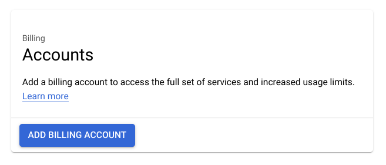

After doing so you should see your billing account as follows:

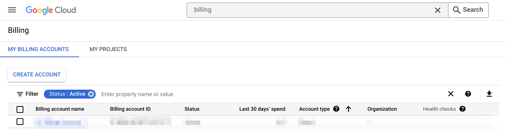

Let's set up a budget and some alerts to avoid spending money by mistake.
Clicking on the Billing Account takes us to the Billing Account overview:

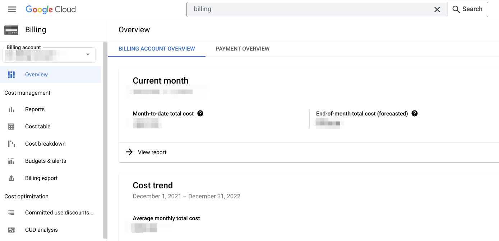

Then go to "Budgets & alerts", click on "Create Budget" and follow the steps to set up a very low budget (something like
10 USD is good enough) and some alerts (I use 50%, 90%, and 100%):

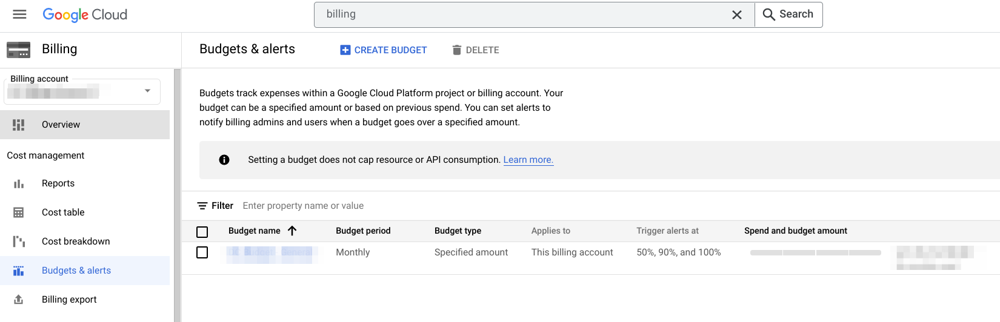

This way if during any future month we start spending money by mistake, and reach 5 USD, we'll get a notification via
email and we can go to our GCP Project and change or stop whatever service is spending money.
Besides, we can always just go to our Billing Account overview and manually check if it's spending any money or not.

Now we have to assign this billing account to the project, so go to Billing > Projects, and you'll see your GCP project
there, which will have the billing disabled because so far no Billing Account has been assigned to it:

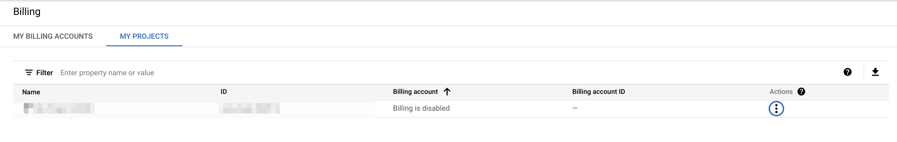

To assign the billing account to it, click on the 3 dots, and click on Change Billing, and follow the steps:

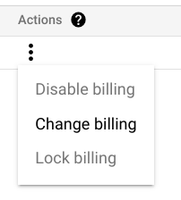

And that's it!
We can now enable services that require Billing to be active, like Compute Engine.

### Spin up a VM

The GCP free tier specifications for Compute Engine might be changed by Google eventually, so by all means do check them
out in the [official docs][gcp-free-tier-compute-engine].
At the moment they are like this:

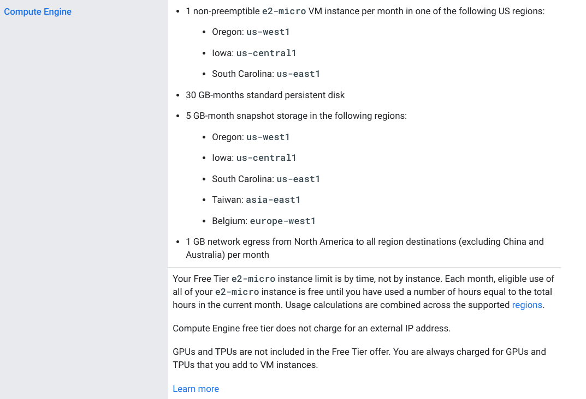

So we can spin up an e2-micro VM with a 30 GB standard persistent disk.

First, we need to enable the Compute Engine service:

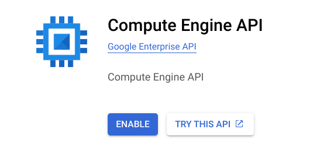

And then create a VM by clicking on "Create Instance".

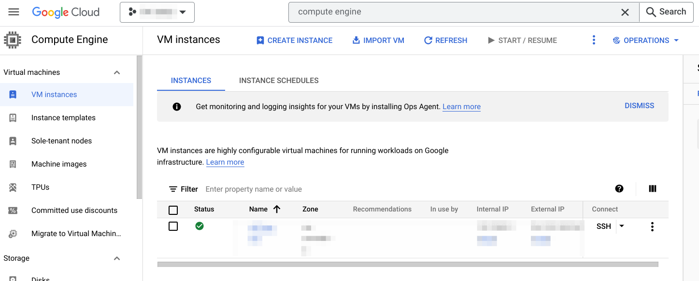

Follow the steps by selecting all the free options according to what is [currently free][gcp-free-tier-compute-engine],
and once that is finished the VM Instance will be listed in "Compute Engine" > "VM Instances" (as can be seen in the
picture above, blurred).

[gcp-free-tier-compute-engine]: https://cloud.google.com/free/docs/free-cloud-features#compute

### Connect to the VM

Then we'll need to be able to connect to this VM via SSH, so we can set up our application to run there.
To get the gcloud command, click on the 3 dots and then on "View gcloud command".
This will prompt a dialog that displays the command that we will need to use to connect to the VM.

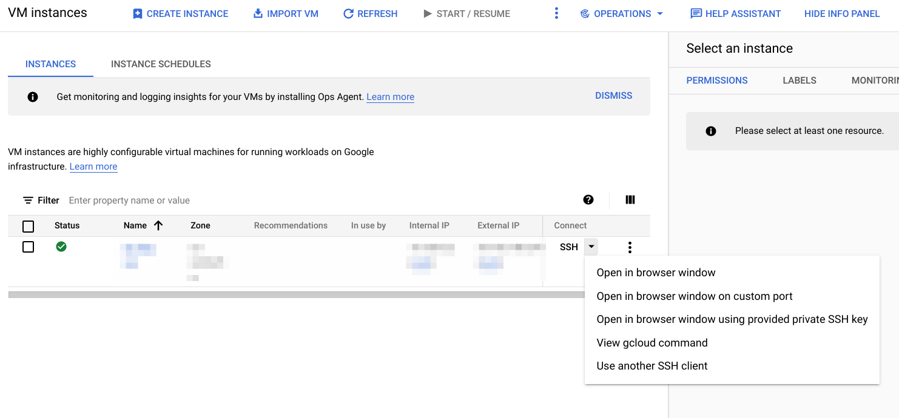

However, to use this command we need to install and configure gcloud in our local machine (where we are developing our application).
To do so, just follow the [official docs for the gcloud sdk][gcloud-docs].

[gcloud-docs]: https://cloud.google.com/sdk/docs/install-sdk

After doing so, we can simply use the gcloud command that we got from the terminal in our local machine, and we'll SSH
into our VM:

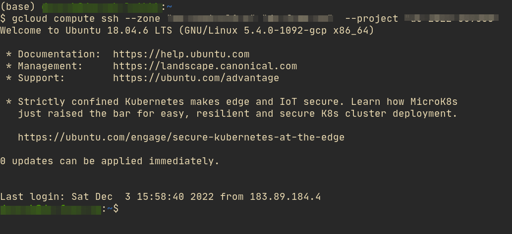

Success!
This means that we can connect to the VM and copy over our code and set up a cronjob so it runs every hour automatically
for us.
More on this in the next subsections.

### Copy the code

Let's assume we have our application contained in the directory `/path/to/local/app` in our local machine, and we want
to put it in the directory `/path/to/remote/app` in the VM.

First we can compress the folder:

```bash
$ tar cf /tmp/temp.tar -C /path/to/local/app .
```

Then we can send it over to the VM with SCP:

```bash
gcloud compute scp --zone $ZONE --project $PROJECT --recurse /tmp/temp.tar "$INSTANCE:/path/to/local/app"
```

And extract it in the VM:

```bash
gcloud compute ssh --zone $ZONE $INSTANCE  --project $PROJECT --command="cd /path/to/local/app && tar xf temp.tar"
```

And done!
We now have our code in the VM.
However, it cannot yet be executed since we still haven't installed Python and our app requirements with pip.

### Set up the VM

To be able to execute our application in the VM, we need to install Python and the requirements (requests, Beautiful
Soup, and the GMail API libraries).

First of all, SSH into the VM:

```bash
$ gcloud compute ssh --zone $ZONE $INSTANCE  --project $PROJECT
```

Now we install python in the VM using apt:

```bash
$ sudo apt install python3.8 python3.8-venv
```

After doing this we'll set up a virtual environment so we can run our app in an isolated environment:

```bash
$ cd /path/to/remote
$ python3.8 -m venv .venv
$ . .venv/bin/activate
$ pip install requests beautifulsoup4 ...
```

And finally we'll try to run the app to test that it works properly:

```bash
$ cd app
$ python script.py
```

And done, if it runs it means that evevrything is ready codewise, we just need to set up a cronjob so the script runs
every hour.

### Set up a cronjob

We'll set up a cronjob, which is quite easy to do with:

```bash
$ crontab -e
```

This will open up an editor, where we need to add a line into it:

```
0 * * * * cd /path/to/remote && .venv/bin/python app/script.py
```

We can check that the new cronjob is correctly set by checking the syslog:

```
tail /var/log/syslog
```

And done!
